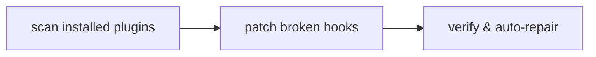

<div align="center">

# win-hooks

### *"Linux? Nah. WinUX!"*

**Windows auto-patcher for vibe coders.**

Your AI coding tools work on Windows. Their plugins mostly don't.<br>
win-hooks fixes them for you — automatically, every session.

[](LICENSE)
[](https://www.microsoft.com/windows)
[](https://docs.anthropic.com/en/docs/claude-code)
[](https://developers.openai.com/codex)

</div>

---

## You know this screen

```
SessionStart hook error: /bin/bash: command not found
PreToolUse hook error: scripts/check.sh: No such file or directory
PostToolUse hook error: semgrep: command not found
```

You installed a plugin. It works fine for everyone on a Mac. On your machine it greets you with red text every single time you open a session.

Nothing is broken on your end. Almost every plugin is written and tested on macOS or Linux, so its hooks quietly assume Unix tools that Windows does not have. You are not supposed to fix that by hand. **win-hooks does it for you.**

## Install it once, forget it exists

**Claude Code**

```bash
claude plugin marketplace add LilMGenius/win-hooks && claude plugin install win-hooks
```

**Codex**

```bash
codex plugin marketplace add LilMGenius/win-hooks && codex plugin add win-hooks@win-hooks
```

That's it. No config, no flags, nothing to remember. From then on win-hooks checks your plugins at the start of every session and repairs whatever broke — including plugins you install later, and plugins that break again after an update.

Prefer a one-shot fix, or need it in CI? Skip the plugin and run it directly:

```bash
npx @lilmgenius/win-hooks           # repair every installed plugin, now
npx @lilmgenius/win-hooks status    # show what it found last time
```

## What it actually fixes

| The error you see | What was wrong |
|---|---|
| `check.sh: No such file or directory` | Windows can't run a `.sh` script directly |
| `semgrep: command not found` | The plugin expects a Unix tool you don't have |
| `'node' is not recognized` | Works in Git Bash, invisible to the process that launches hooks |
| `Python was not found; ... Microsoft Store` | Windows' fake `python3` placeholder shadowing your real one |
| `JSON Parse error: Unrecognized token` | An invisible byte (BOM) at the top of a config file |
| `Cannot find module 'C:\Users...'` | Backslashes in a path getting eaten before the hook runs |

Every repair is made next to the original file, never on top of it. The plugin's own files are backed up, and anything already working is left alone.

## Staying fixed



That runs at session start, and again on your next prompt if a plugin updated itself in the meantime — because an update reinstalls the plugin's original, still-broken hooks. When win-hooks re-patches mid-session it tells you to run `/reload-plugins`, which picks up the fix without restarting.

Because the healthy path is silent, it also leaves a short log behind:

```bash
npx @lilmgenius/win-hooks status
```

Or, inside a session:

| Command | What it does |
|---|---|
| `/win-hooks:status` | Show what's healthy, what's broken, and when it last ran |
| `/win-hooks:fix` | Run the repair now, instead of waiting for the next session |

## Requirements

Windows 10/11, and [Git for Windows](https://git-scm.com/download/win) — which you almost certainly already have. Node.js comes with Claude Code and Codex.

## Privacy

win-hooks runs entirely on your machine and sends nothing anywhere. No telemetry, no network calls, no account. The only thing it writes outside a plugin's own folder is a short local log of its own runs, so you can check it actually ran.

## For the curious

win-hooks never edits a plugin's own scripts. It writes a small `_hooks/` directory next to them, containing one wrapper per broken hook plus a single `run-hook.cmd` — a file that is valid batch *and* valid shell at once, so Windows and Git Bash can each run the same entry point. The plugin's `hooks.json` is then pointed at the wrapper, with the original saved as `hooks.json.bak`.

```
plugin/
├── hooks/
│   ├── hooks.json          → now points at the wrapper
│   └── hooks.json.bak      → your original, untouched
└── _hooks/
    ├── run-hook.cmd        → batch + shell polyglot entry point
    └── check               → resolves the real interpreter, then execs
```

Codex works the same way, with one difference: it has a native `commandWindows` field, so win-hooks *adds* the Windows command instead of replacing the portable one. Your plugins keep working unchanged on macOS and Linux.

Wrapper filenames are deliberately extensionless (`check`, not `check.sh`) — Claude Code auto-prepends `bash` to anything containing `.sh` on Windows, which would undo the fix.

Contributors: [`CLAUDE.md`](CLAUDE.md) documents every failure mode win-hooks handles, with the root cause behind each one.

## License

[MIT](LICENSE).
